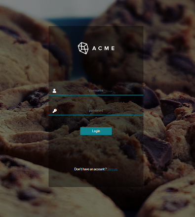

# ReferralApp

Generated with with [Angular CLI](https://github.com/angular/angular-cli) version 7.0.6.

Have you ever feel the necessity to create an account in the most insecure and pointless web application? 🤔. 

Welp, then this is what you're looking for!!
- Create an account in our (not validated) Sing up page.
- Once inside, you (only) can refer a friend, choose your preferred method, send (manually) the generated QR code or get the referral link clicking the button.
- That's it!! (really)

** Try not to use another common password you have (since they are saved as plain text in a publicly accessible manner). 🍆

*** There's not session storage, so once you login, if you refresh the page, you'll have to log in again. 😁

## Getting statred
You'll need [NodeJS](https://nodejs.org/en/) and [Angular CLI](https://github.com/angular/angular-cli).

Run `npm install` in the root folder to install all the dependencies needed.

## Development server

Run `ng serve` for a dev server. Navigate to `http://localhost:4200/`. The app will automatically reload if you change any of the source files.

## Build

Run `ng build` to build the project. The build artifacts will be stored in the `dist/` directory. Use the `--prod` flag for a production build.

## Deploy

*The app and cloud functions are hosted inside [Firebase] https://firebase.google.com/, so, if you are interested in contributing to the project, feel free to ask for access.

Run `npm install` inside the functions folder and `firebase deploy` after that.

## Further help

To get more help on the Angular CLI use `ng help` or go check out the [Angular CLI README](https://github.com/angular/angular-cli/blob/master/README.md), and for Firebase use `firebase help` or go to[Firebase Support](https://firebase.google.com/support/).

Made with ❤️ by Eric.